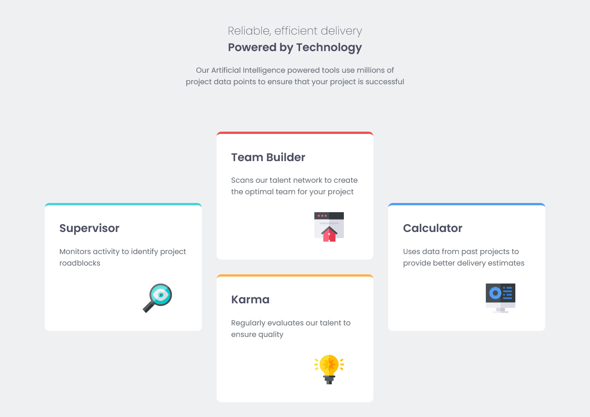
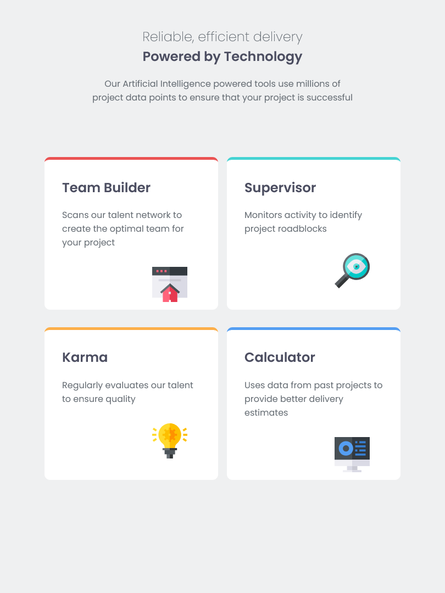
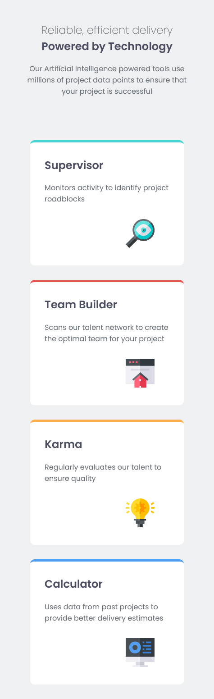

# Four Card Feature Section

A responsive four-card feature section built with HTML and CSS, showcasing different layout techniques across devices.

## Screenshots

### Desktop

### Tablet

### Mobile

## Live Demo

[View Live Site](https://404-heisenberg.github.io/Four-card-feauture/)

## Key Concepts Learned

- **CSS Grid & Flexbox**: Used Grid for desktop layouts and Flexbox for centering and mobile layouts
- **CSS Custom Properties**: Implemented CSS variables for consistent theming and colors
- **Responsive Design**: Mobile-first approach with multiple breakpoints
- **Grid Template Areas**: Used named grid areas for complex layout positioning

## Built With

- HTML5
- CSS3
- CSS Grid
